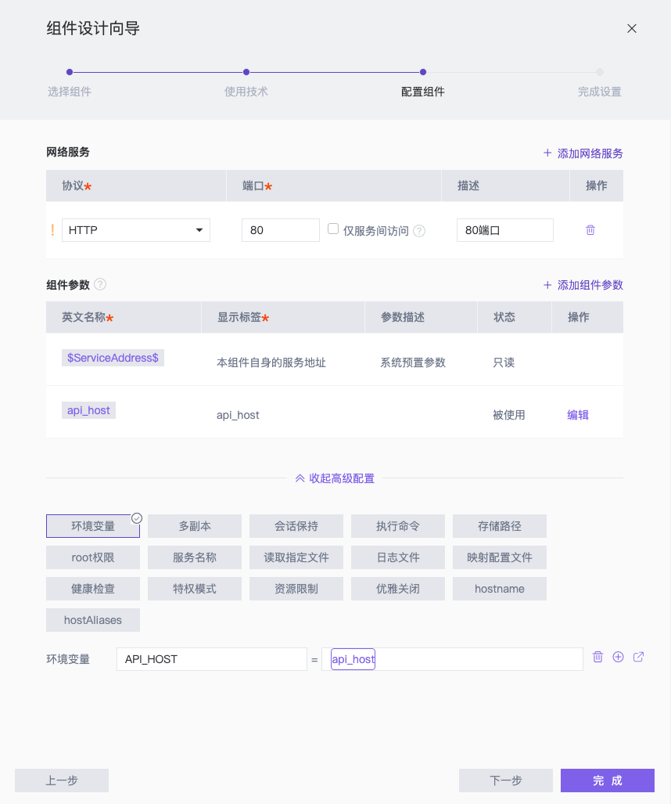

# StarOS 演示项目 - 前端

该仓库为 [StarOS](http://staros.cloud) 的演示项目 **Wall** 中的前端组件。

**Wall** 项目的其余组件为：
- 后端组件：[example-wall-backend](https://github.com/StarOS-Cloud/example-wall-backend)
- 数据库组件：[example-wall-db](https://github.com/StarOS-Cloud/example-wall-db)

## 简介
该组件使用 Node.js/Vue2 进行开发，主要组件为：

 - `./src/components/Wall.vue`  用于编写整个 Web 界面和 API 调用、渲染。

由于前端组件需要额外添加 HTTP Server 才可以独立部署，该组件在镜像构造过程中使用了分段构造，并使用了 Nginx 作为 HTTP Server。相关文件为：
- `./nginx/default.conf`  Nginx 配置文件，用于对 API 接口进行代理。
- `./start.sh` 启动脚本，用于替换环境变量，并启动 Nginx。


## 在 StarOS 中使用

### 技术栈
该仓库已内置 Dockerfile，使用 **Dockerfile in source** 技术栈即可。

### 组件配置
在 StarOS 中，该组件的配置方式如下：
1. 声明协议 `HTTP`，端口为 `80` （Nginx 的默认端口）
2. 利用连线，将[后端组件](https://github.com/StarOS-Cloud/example-wall-backend)的访问地址连接至环境变量 `API_HOST` 

可参考下图进行配置：


## 开发

您可以通过对该仓库进行 Fork 来二次开发。

如果您熟悉 Vue，可尝试修改 `./src/components/Wall.vue` 来改变界面的展示与 API 调用。

如需调试代码，需确保编码环境已经安装了 Node.js，并执行如下代码拉取依赖：

``` shell
npm install
```

使用该命令即可实时渲染 Web 界面，并监控文件改动动态更新：

``` shell
npm run serve
```

## 部署 

### 构建
在命令行中键入如下命令，即可在本地构建镜像（需要先安装 Docker）：
``` shell
# 克隆代码
git clone https://github.com/StarOS-Cloud/example-wall-web.git
# 构建命令
docker build -t wall/api:latest ./example-wall-web
```

### 运行
在命令行中运行如下命令，即可运行：
``` shell
docker run -d --name wall-web \
    -p 80:80 \
    -e API_HOST=<api-host> \
    wall/web
```

其中：
- `<API_HOST>` 为[后端组件](https://github.com/StarOS-Cloud/example-wall-backend)的访问地址

建议先部署[后端组件](https://github.com/StarOS-Cloud/example-wall-backend)与[数据库组件](https://github.com/StarOS-Cloud/example-wall-db)后，再运行该组件。

## 关于
[StarOS](http://staros.cloud) 是一款一站式云原生在线开发平台，致力于探索云原生应用的研发模式最佳实践。

如果您对我们感兴趣，或有任何问题或建议，欢迎随时联系我们：


邮箱：[hi@staros.cloud](mailto://hi@staros.cloud)
